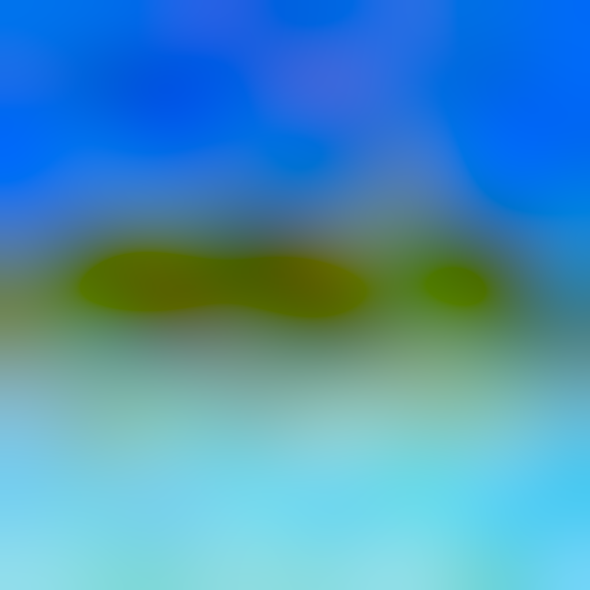

# Blurhash

This is a library that implements blurhash algorithm on GPU with CUDA. It allows fast encoding of images into strings of characters which can be later decoded to obtain a blurred version of the original image. It's especially useful for sending decoded images over the network in order to display a placeholder blurred image before the original image arrives. This efficient CUDA implementation allows for up to 70 times faster encoding and 30 times faster decoding!

Reference image             |  Decoded image
:-------------------------:|:-------------------------:
  |  

Blurhash of reference image: `:xAMf7n$Wtoba%fQj]f8H$WXkDaxfja#fPfRcIj[ada}j=fkf6a|n#a#j;fkf5j?a#j?ekj=k9fkj[jrj]f5bajYa$a#a~aybHj[ofbIa~jba#f6jsbHWZj]jsa{axj[jYa#`


The CPU implementation, used for processing time comparison, has been adopted from the original [Blurhash](https://github.com/woltapp/blurhash/tree/master) repository.

## Building

Requirements:
- cmake 
- make
- gcc/clang/msvc
- cuda

Standard cmake build procedure:
```
cmake -B build -S .
cmake --build build
```

To build the standalone executable set `BLURHASH_BUILD_STANDALONE` to `ON`:
```
cmake -B build -S . -DBLURHASH_BUILD_STANDALONE=ON
```

## Executable

### Encoding

`blurhashed encode {cpu|gpu|both} xComponents yComponents imageFile`

- cpu - run encoding on cpu
- gpu - run encoding on gpu
- both - run encoding on both platforms
- xComponents - number of encoded components along x axis (1-8)
- yComponents - number of encoded components along y axis (1-8)
- imageFile - path to image to encode in either jpg or png format

example: `build/blurhashed encode gpu 8 8 resources/gpu_test.png`

### Decoding

`blurhash decode {cpu|gpu|both} hash width height imageFile [punch]`

- cpu - run decoding on cpu
- gpu - run decoding on gpu
- both - run decoding on both platforms
- hash - blurhash to decode
- width - output image width (32-1024)
- height - output image height (32-1024)
- imageFile - output image path (in case option both is selected filename is prepended with 'cpu_' and 'gpu_')
- punch - additional value to amplify colors in decoded image (1-8, default 1)